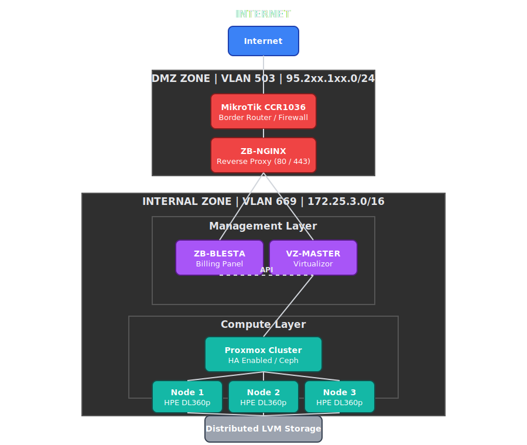
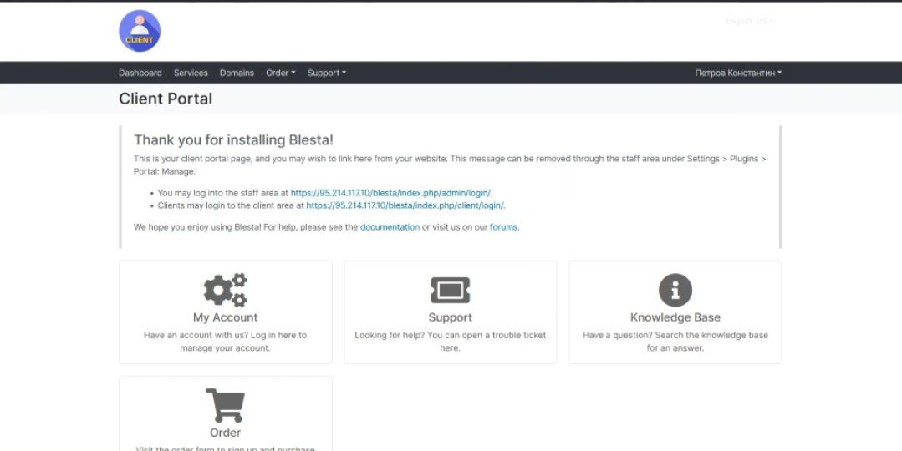

# Diploma-Project

# Proxmox VE Billing Integration System

> Automated VPS lifecycle management with integrated billing for data center operations.


---

## 📋 Table of Contents

- [Overview](#-overview)
- [Architecture](#architecture)
- [Technical Specifications](#technical-specifications)
- [Rack Configuration](#rack-configuration)
- [Virtual Infrastructure](#virtual-infrastructure)
- [Configuration](#configuration)
- [Infrastructure](#-infrastructure)
- [Economic Analysis](#-economic-analysis)
- [Results](#results)
- [Key Metrics](#key-metrics)
- [Author](#author)
- [Education](#education)
- [Organization](#organization)
- [License](#-license)
- [Acknowledgments](#-acknowledgments)
- [Insights & Future Prospects](#-insights-and-future-prospects)

---

## 🎯 Overview

### Project Goal
Automate VPS lifecycle management with integrated billing for Data Center operations.

### Business Problem
| Problem | Impact | Solution |
|---------|--------|----------|
| Manual VM provisioning | 1-day deployment time | Automated templates (1-2 hours) |
| No resource tracking | Billing inaccuracies | Proxmox + Virtualizor metrics |
| VMware license costs | High operational expenses | Proxmox VE (open-source) |

### Solution Architecture
Proxmox VE + Virtualizor + Blesta integration for full automation.

### Scope
- **3 physical nodes** (HPE DL360p Gen8)
- **35+ client migration plan**
- **99.9% SLA target**
- **10 months payback period**

<br>
<br>

---

## 🏗️ Architecture

### Network Topology

*Network architecture diagram*
<p align="center"></p>


### VLAN Segmentation

| VLAN ID | Purpose | IP Range | Components |
|---------|---------|----------|------------|
| VLAN 503(ext) | Billing | 95.2xx.1xx.0/24 | Nginx proxy, Public IP |
| VLAN 669(int) | Management | 172.25.3.0/16 | Proxmox, Virtualizor, Blesta |

### Component Flow



### HPE ProLiant DL360p Gen8 - Front View
<p align="center"></p>


### HPE ProLiant DL360p Gen8 - Rear View (Power & Network)
<p align="center"></p>


## Technical Specifications

| Parameter | Specification |
|-----------|---------------|
| **Model** | HPE ProLiant DL360p Gen8 |
| **Form Factor** | 1U Rack Server |
| **CPU** | 2 × Intel Xeon E5-2697 v2 (12C / 24T each) |
| **Total CPU Threads** | 48 |
| **RAM** | 256 GB DDR3 ECC Registered |
| **Maximum RAM** | 768 GB |
| **Storage Bays** | 8 × 2.5" SFF SAS/SATA |
| **RAID Controller** | HP Smart Array P420i |
| **Network Interfaces** | 4 × 1GbE + optional 10GbE |
| **Remote Management** | HP iLO 4 |
| **Power Supply** | 2 × 460W Hot-Plug (Redundant) |
| **Virtualization Support** | VT-x, VT-d, SR-IOV |

## Rack Configuration

| Rack Unit | Component | Power Supply |
|----------|-----------|--------------|
| 1U | HPE DL360p Gen8 (Node 1) | 2 × 460W |
| 1U | HPE DL360p Gen8 (Node 2) | 2 × 460W |
| 1U | HPE DL360p Gen8 (Node 3) | 2 × 460W |
| Network | MikroTik CCR1036 | 1 × PSU |
| Virtual Layer | Nginx / Blesta / Virtualizor VMs | Shared |

## Virtual Infrastructure

### VM Resource Allocation

| VM | vCPU | RAM | Storage | Network | Purpose |
|----|------|-----|---------|---------|---------|
| **Nginx** | 2 | 4 GB | 50 GB | VLAN 503 + 669 | Reverse Proxy |
| **Blesta** | 2 | 4 GB | 65 GB | VLAN 669 | Billing System |
| **Virtualizor** | 3 | 6 GB | 100 GB | VLAN 503 + 669 | VPS Management |

#### Nginx VM
<p align="center"></p>


#### Virtualizor VM
<p align="center"></p>


#### Blesta VM
<p align="center"></p>


## Configuration

### Nginx Reverse Proxy
#### 1) Installation nginx & utilities
```bash
sudo apt update

sudo apt install -y nginx nginx-extras libmodsecurity3
```
#### 2) Configuration File:
> /etc/nginx/sites-available/billing


<p align="center"></p>

### Blesta Billing System

#### 1) Installation

```bash
sudo apt update
sudo apt upgrade -y

sudo apt install -y \
php \
php-mysql \
php-curl \
php-xml \
php-mbstring \
php-gd
```
> **Full blesta installation guide is here: https://docs.blesta.com/installation**

#### 2) Setup 
> **(This step should begining after virtualizor installation is already completed!!!)**

Open in browser:
```
https://your-domain.com/blesta (short path provided by our nginx reverse proxy)
```

* And go to the packages settings, so, for Blesta, Virtualizor have official packages which installed by instructions:

https://www.virtualizor.com/docs/billing/blesta-module/


<p align="center"></p>


### Virtualizor Panel
#### 1) Installation

* **Download the official installation script, select appropriate options, and execute.**


<p align="center"></p>

```markdown
**Installation completed**
```
<br>
<br>

<p align="center"></p>

<br>
<br>

* **Restart the VM to apply changes and access the panel at https://external_ip/.**


<p align="center"></p>
<br>
<br>

* **LogIn and checking important info in panel:**


<p align="center"></p>
<br>
<br>


#### 2) IP Pools
* Virtualizor panel need to know which exactly networks should be used in working with commercial services provided by platform VM creation. Now, you needed to add two main networks in Virtualizor, which get access customers to their remote VMs(services).
* Add through netplan complete network config on VIrtualizor VM.(remember that the one VLAN just for remote access, and other for pairs with performance cluster servers, which are store all VMs).


<p align="center"></p>
<br>

* Add ip pool, by recommended way in official docs: https://www.virtualizor.com/docs/admin-api/create-ip-pool/


> **External IP pool:**
<p align="center"></p>
<br>

> **Internal IP pool:**
<p align="center"></p>
<br>

---


* **After that, by early added media iso(just upload it from pc) for ending test of this whole project.**
<p align="center"></p>
<br>

---


* **Also, wad added template(flexible paid tariff of service hosting).**
<p align="center"></p>
<br>

---


### Proxmox Cluster nodes

* For complete all components of this project, you should have finish setuping pre-configured server nodes, which have already proxmox installation and just needed Virtualizor install above them(important: kernel should be exactly Proxmox, not kvm or another, else work will broke). Installation via official script is already demonstrated, step skipped here.

* After installing the Virtualizor on every proxmox node in cluster(3 of 3), you must add from main server Virtualizor(VM) add slave servers(proxmox cluster nodes), and then our main server become a "Master server", from where you can setup any options on every slave nodes(needed some setup in API section(API token) inside proxmox):


<p align="center"></p>
<br>

---


>After that, you have 2 values(API token name & secret key), go to Master server to th panel, choose Servers--Add new server(and provide server info from the Slave server), then for a get access to creating, managing, deleting VMs, you provide 2 values from proxmox API section to the slave setup in left panel of main server Virtualizor:


* **Add info for managing slave server**
<p align="center"></p>
<br>

* Do the same with remain servers. Next step is adding LVM(multipath - pairs to all 3 nodes of cluster) storage, already configured by another department(but you can imagine that the storage is just standard LVM, it doesnt matter in this case).

<p align="center"></p>
<br>

---


### Blesta - add 1st service


#### 1) add package

* Like you see earlier in this project, you have integration (Blesta to Virtualizor) module, so by module, which provide a lot of useful functions, you have to setup one test package based on that module. Firstly you must create our 1st purchase form for customers:

<p align="center"></p>
<br>

---


* **Now, you can add a package(with specific options):**
<p align="center"></p>
<br>

---


* **Then, LogIn to the client Area and choose created package with a flexible options:**
<p align="center"></p>
<br>

---

* **Since a payment gateway is not yet configured, services can also be provisioned via the Staff Area.**
<p align="center"></p>
<br>

---
* In summary, the project demonstrates automated VPS provisioning through integrated Blesta and Virtualizor modules. The setup provides a clear workflow for VM deployment and billing, showcasing the potential for further expansion, optimization, and automation in a data center environment. Security and fault tolerance were not fully implemented due to the demonstration nature of this project.


* Below I will show you a video of approximately the work without other improvements, but how it looks from the administrator's side, although it will affect the client-side parts at the beginning. 
Demo video for administrator workflow.
<br>

## 🎥 Infrastructure

[](docs/VID_20260309_140302_161.mp4)(https://youtu.be/XYLq4wfqd-w)

---


<br>

## 💰 Economic Analysis
### **Implementation Costs**
| Cost Category | Amount (RUB) | Amount (USD) |
|---------------|--------------|--------------|
| Labor (SysAdmin, 336 hours) | 180,000 |2,000 |
| Labor (Engineer, 20 hours) | 14,286 | $160 |
| Social Contributions (30.2%) | 58,675 | $650 |
| Electricity (544 kWh) | 3,277 | $36 |
| Equipment Amortization | 2,300 | $26 |
| Total | 258,538 | $2,872 |
<br>

> 💱 Exchange rate: 1 USD ≈ 90 RUB (2025)


### **Revenue Projection**
| VPS Type | Clients | Tariff (RUB/month) | Revenue (6 months) |
|----------|---------|--------------------|--------------------|
| Internal IP | 22 | 600 | 79,200 RUB |
| External IP | 13 | 900 | 70,200 RUB |
| Total | 35 | — | 149,400 RUB |

<br>

>**Payback Period**
Formula: T_payback = Total_Costs / Monthly_Revenue
T_payback = 258,538 RUB / 24,900 RUB/month ≈ 10.4 months

<br>

| Metric | Value |
|--------|-------|
| Total Investment | 258,538 RUB ($2,872) |
| Monthly Revenue | 24,900 RUB ($277) |
| Payback Period | ~10 months |
| ROI (Year 1) | 20% |
<br>

---

## Results


**Achievements**

<br>

| Goal | Status | Details |
|------|--------|---------|
| Proxmox Cluster Deployment | ✅ Complete | 3 nodes, HA enabled |
| Virtualizor Integration | ✅ Complete | Master + 3 slaves |
| Blesta Billing Setup | ✅ Complete | Module installed, configured|
| Automated VPS Provisioning | ⚠️ Partial | API integration working, automation pending |
| Client Portal | ✅ Complete | Order form, notifications |
| Monitoring (Zabbix) | ✅ Complete | 200+ metrics, Telegram alerts |
<br>


## Key Metrics


| Metric | Before | After | Improvement |
|--------|--------|-------|-------------|
| VM Deployment Time | [ 1 day | 1-2 hours | 87% faster |
| Incident Response | 4 hours |	2.4 hours | 40% faster |
| Billing Accuracy | Manual | Automated | 100% accurate |
| License Costs | VMware (high) | Proxmox (free) | ~$5,000/year saved |


## Author


**Konstantin Petrov
Network & System Administrator**
| 📧 Email | sdelkasdelkovich@gmail.com |
|--------|-------------|
| 💬 Telegram | [@Username](https://t.me/yourfearis) |


---

## Education


**St. Petersburg College of Electronics and Information Technology
Network and System Administration (09.02.06)
Expected Graduation: July 2025**

<br>

## Organization

**LLC DC Zelobit (Data Center & ISP)
Infrastructure support and implementation**

<br>

## 📄 License

**This project is part of diploma work at St. Petersburg College of Electronics and Information Technology (2025).**
<br>

<p></p>

## 🙏 Acknowledgments

* LLC DC Zelobit (infrastructure support)
* Virtualizor Team (documentation and API)
* Proxmox Community (technical support)
* Blesta Team (billing module)

<br>


---

<br>

## ✨ Insights and Future Prospects

This project demonstrates the practical implementation of **automated VPS provisioning, billing integration, and infrastructure orchestration** for a small-scale data center. It showcases the ability to **design, deploy, and manage complex virtualized environments** with minimal manual intervention.

### 🔧 Key Takeaways

* **Automation efficiency:** Deployment time reduced from **1 day → 1–2 hours** ⚡
* **Accurate billing:** Integration of Blesta + Virtualizor ensures **100% invoicing precision** 💵
* **Resource optimization:** Dedicated VM allocation with proper CPU, RAM, and storage planning
* **Network segmentation:** VLAN design ensures **secure traffic separation** 🔒
* **Centralized monitoring:** 200+ metrics tracked via Zabbix, with real-time Telegram alerts 📈

### 🖥️ Technical Highlights

* **Clustered nodes:** 3 × HPE ProLiant DL360p Gen8, HA-ready, pre-configured for virtualization
* **Flexible templates:** Custom VM and billing packages for scalable client offerings
* **API integration:** Streamlined communication between Proxmox, Virtualizor, and Blesta
* **Open-source advantage:** Cost-effective deployment without licensing overhead 💡

### 🚀 Professional Skills Demonstrated

* Infrastructure design & implementation
* Virtualization & VM orchestration
* Networking & VLAN configuration
* System automation & API usage
* Monitoring & operational troubleshooting

### 📌 Project Impact

* **Operational efficiency:** Significant reduction in manual tasks
* **Client-ready workflow:** Ready-to-use templates and purchase forms
* **Scalable foundation:** Easily expandable cluster and VM pool 🌐
* **Documentation & reproducibility:** Clear setup steps for real-world deployment

### 🔮 Future Enhancements

* Full API-driven automation for provisioning & billing
* Integration with live payment gateways 💳
* Advanced storage & network performance optimization
* Enhanced security and fault-tolerance mechanisms

This project reflects **hands-on expertise in modern system administration**, combining **virtualization, automation, and billing integration** to deliver a professional-grade demo environment. 🌟

---
