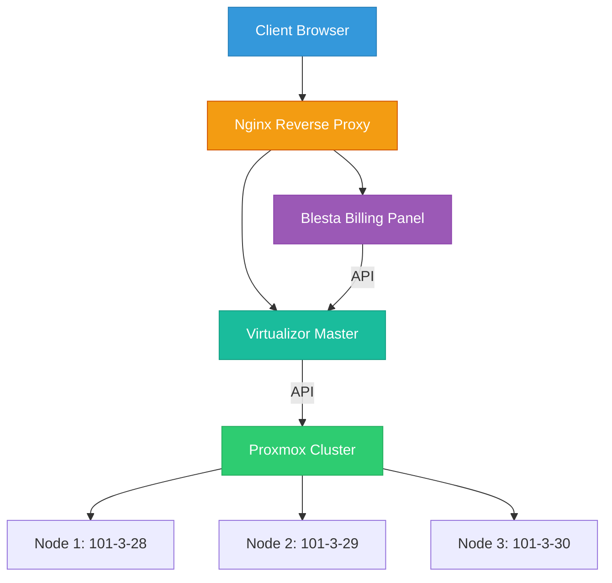
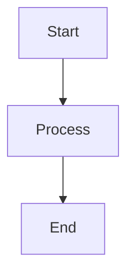

# Diploma-Project
Billing integration with Proxmox Virtualization.

# Proxmox VE Billing Integration System

> Automated VPS provisioning and billing system for Data Center infrastructure


---

## 📋 Table of Contents

- [Overview](#-overview)
- [Architecture](#-architecture)
- [Hardware Specifications](#-hardware-specifications)
- [Virtual Infrastructure](#-virtual-infrastructure)
- [Implementation](#-implementation)
- [Integration](#-integration)
- [Economic Analysis](#-economic-analysis)
- [Results](#-results)
- [Documentation](#-documentation)
- [Author](#-author)

---

## 🎯 Overview

### Project Goal
Automate VPS lifecycle management with integrated billing for Data Center operations.

### Business Problem
| Problem | Impact | Solution |
|---------|--------|----------|
| Manual VM provisioning | 1 day deployment time | Automated templates (1-2 hours) |
| No resource tracking | Billing inaccuracies | Proxmox + Virtualizor metrics |
| VMware license costs | High operational expenses | Proxmox VE (open-source) |

### Solution Architecture
Proxmox VE + Virtualizor + Blesta integration for full automation.

### Scope
- **3 physical nodes** (HPE DL360p Gen8)
- **35+ client migration plan**
- **99.9% SLA target**
- **10 months payback period**

---

## 🏗️ Architecture

### Network Topology

<div align="center">

### VLAN Segmentation

| VLAN ID | Purpose | IP Range | Components |
|---------|---------|----------|------------|
| VLAN 503 | Management | 10.0.503.0/24 | Proxmox, Virtualizor, Nginx |
| VLAN 669 | Billing | 10.0.669.0/24 | Blesta, Internal Services |
| External | Client VPS | 95.2xx.1xx.0/24 | Public IP pool |

### Component Flow


### HPE ProLiant DL360p Gen8 - Front View
<div align="center">

### HPE ProLiant DL360p Gen8 - Rear View (Power & Network)
<div align="center">

# 📁 GitHub Repository Structure (Single-File Professional Format)

Вот **полная структура README.md** для твоего диплома на GitHub. Всё в одном файле, профессиональное форматирование, готовые шаблоны для вставки контента.

---

## 📄 README.md (Полный Шаблон)

```markdown
# Proxmox VE Billing Integration System

> Automated VPS provisioning and billing system for Data Center infrastructure


---

## 📋 Table of Contents

- [Overview](#-overview)
- [Architecture](#-architecture)
- [Hardware Specifications](#-hardware-specifications)
- [Virtual Infrastructure](#-virtual-infrastructure)
- [Implementation](#-implementation)
- [Integration](#-integration)
- [Economic Analysis](#-economic-analysis)
- [Results](#-results)
- [Documentation](#-documentation)
- [Author](#-author)

---

## 🎯 Overview

### Project Goal
Automate VPS lifecycle management with integrated billing for Data Center operations.

### Business Problem
| Problem | Impact | Solution |
|---------|--------|----------|
| Manual VM provisioning | 1 day deployment time | Automated templates (1-2 hours) |
| No resource tracking | Billing inaccuracies | Proxmox + Virtualizor metrics |
| VMware license costs | High operational expenses | Proxmox VE (open-source) |

### Solution Architecture
Proxmox VE + Virtualizor + Blesta integration for full automation.

### Scope
- **3 physical nodes** (HPE DL360p Gen8)
- **35+ client migration plan**
- **99.9% SLA target**
- **10 months payback period**

---

## 🏗️ Architecture

### Network Topology

```
┌─────────────┐     ┌──────────────┐     ┌─────────────┐
│   Internet  │────▶│  MikroTik    │────▶│  ZB-NGINX   │
│   (Public)  │     │  +Firewall   │     │  (Proxy)    │
└─────────────┘     └──────────────┘     └─────────────┘
                                                │
                                    ┌───────────┼───────────┐
                                    │           │           │
                                    ▼           ▼           ▼
                              ┌──────────┐ ┌────────── ┌──────────────┐
                              │ ZB-BLESTA│ │ZB-VIRT.  │ │ PROXMOX      │
                              │ (Billing)│ │(Master)  │ │ Cluster      │
                              └────────── └──────────┘ ──────────────┘
                                                          │
                                    ┌───────────┬─────────┼─────────┬───────────┐
                                    │           │         │         │           │
                                    ▼           ▼         ▼         ▼           ▼
                               ┌─────────┐ ┌───────── ┌─────────┐ ─────────┐
                               │ Node 1  │ │ Node 2  │ │ Node 3  │ │ Storage │
                               │101-3-28 │ │101-3-29 │ │101-3-30 │ │  (LVM)  │
                               │ HPE DL  │ │ HPE DL  │ │ HPE DL  │ │         │
                               └─────────┘ └─────────┘ └─────────┘ └─────────┘
```

### Network Diagram

> 📷 **Insert Image Template:**
> ```markdown
> 
> *Figure 1: Network architecture with reverse proxy and VLAN segmentation*
> ```

### VLAN Segmentation

| VLAN ID | Purpose | IP Range | Components |
|---------|---------|----------|------------|
| VLAN 503 | Management | 10.0.503.0/24 | Proxmox, Virtualizor, Nginx |
| VLAN 669 | Billing | 10.0.669.0/24 | Blesta, Internal Services |
| External | Client VPS | 95.214.117.0/24 | Public IP pool |

### Component Flow



---

## 🖥️ Hardware Specifications

### Server Configuration

> 📷 **Insert Image Template:**
> ```markdown
> 
> *Figure 2: HPE ProLiant DL360p Gen8 - Front View*
> 
> 
> *Figure 3: HPE ProLiant DL360p Gen8 - Rear View (Power & Network)*
> ```

### Technical Specifications

| Parameter | Specification |
|-----------|---------------|
| **Model** | HPE ProLiant DL360p Gen8 |
| **Form Factor** | 1U Rack-mount |
| **CPU** | 2× Intel Xeon E5-2697 v2 (12 cores, 24 threads each) |
| **RAM** | 256 GB DDR3 ECC Registered (max 768 GB) |
| **Storage** | 8× 2.5" SFF SAS/SATA Hot-Plug |
| **RAID Controller** | HP Smart Array P420i |
| **Network** | 4× 1Gbit Ethernet (built-in) + 2× 10Gbit (optional) |
| **Management** | HP iLO 4 (remote KVM, power control) |
| **Power Supply** | 2× 460W Hot-Plug (redundant) |
| **Virtualization** | VT-x, VT-d, SR-IOV supported |

### Rack Configuration

| Rack Unit | Component | Power Supply |
|-----------|-----------|--------------|
| 3U Total | 3× HPE DL360p Gen8 | 2× PSU each (redundant) |
| Network | MikroTik CCR1036 + Firewall | 1× PSU |
| Management | Nginx/Blesta/Virtualizor VMs | Shared |

> 📷 **Insert Image Template:**
> ```markdown
> 
> *Figure 4: Rack layout with power redundancy*
> ```

---

## 💻 Virtual Infrastructure

### VM Resource Allocation

| VM | vCPU | RAM | Storage | Network | Purpose |
|----|------|-----|---------|---------|---------|
| **Nginx** | 2 | 4 GB | 50 GB | VLAN 503 + 669 | Reverse Proxy |
| **Blesta** | 2 | 4 GB | 65 GB | VLAN 669 | Billing Panel |
| **Virtualizor** | 3 | 6 GB | 100 GB | VLAN 503 + 669 | VPS Management |

> 📷 **Insert Image Template:**
> ```markdown
> 
> *Figure 5: Virtual machine resource allocation*
> ```

### Operating Systems

| Component | OS | Version | Purpose |
|-----------|-----|---------|---------|
| Nginx | Ubuntu Server | 20.04 LTS | Reverse Proxy |
| Blesta | Ubuntu Server | 20.04 LTS | Billing System |
| Virtualizor | Ubuntu Server | 20.04 LTS | VPS Panel (KVM) |
| Proxmox Nodes | Proxmox VE | 8.4 | Hypervisor (Debian-based) |

---

## 🛠️ Implementation

### 1. Nginx Reverse Proxy

**Installation:**
```bash
# Update package list
sudo apt update

# Install Nginx with extras
sudo apt install -y libmodsecurity3 nginx-full nginx-extras

# Copy default config template
sudo cp /etc/nginx/sites-available/default /etc/nginx/sites-available/billing

# Edit configuration
sudo nano /etc/nginx/sites-available/billing
```

**Configuration Template:**
```nginx
# /etc/nginx/sites-available/billing

server {
    listen 443 ssl;
    server_name your-domain.com;
    
    ssl_certificate /path/to/cert.pem;
    ssl_certificate_key /path/to/key.pem;
    
    # Blesta Panel
    location /blesta {
        proxy_pass http://INTERNAL_IP:80;
        proxy_set_header Host $host;
        proxy_set_header X-Real-IP $remote_addr;
        proxy_set_header X-Forwarded-For $proxy_add_x_forwarded_for;
        proxy_set_header X-Forwarded-Proto $scheme;
    }
    
    # Virtualizor Panel
    location /virtualizor {
        proxy_pass http://INTERNAL_IP:4083;
        proxy_set_header Host $host;
        proxy_set_header X-Real-IP $remote_addr;
    }
}
```

> 📷 **Insert Image Template:**
> ```markdown
> 
> *Figure 6: Nginx reverse proxy configuration*
> ```

---

### 2. Blesta Billing System

**Installation:**
```bash
# Update packages
sudo apt update && sudo apt upgrade -y

# Install PHP and dependencies
sudo apt install -y php php-mysql php-gd php-xml php-mbstring php-curl

# Download Blesta
wget https://www.blesta.com/downloads/blesta-v5.0.0.zip
unzip blesta-v5.0.0.zip -d /var/www/blesta

# Set permissions
chown -R www-www-data /var/www/blesta
chmod -R 755 /var/www/blesta
```

**Configuration Steps:**
1. Access `https://your-domain.com/blesta`
2. Complete installation wizard
3. Configure database (MySQL/MariaDB)
4. Set admin credentials
5. Install Virtualizor module

> 📷 **Insert Image Template:**
> ```markdown
> 
> *Figure 7: Blesta billing panel dashboard*
> ```

---

### 3. Virtualizor Master Panel

**Installation:**
```bash
# Update system
sudo apt update && sudo apt upgrade -y

# Install required packages
sudo apt install -y curl wget tar gzip gcc make

# Download Virtualizor installer
wget -N https://files.virtualizor.com/install.sh

# Make executable and run
chmod +x install.sh
sudo bash install.sh
```

**Post-Installation:**
- Access panel: `https://your-server-ip:4083`
- Login: `root` + password from installation output
- Configure network interfaces
- Add IP pools (internal + external)
- Create VPS plans

> 📷 **Insert Image Template:**
> ```markdown
> 
> *Figure 8: Virtualizor master panel*
> ```

---

### 4. Proxmox Cluster Setup

**On Each Node:**
```bash
# Install Proxmox VE (if not pre-installed)
echo "deb http://download.proxmox.com/debian/pve bookworm pve-no-subscription" > /etc/apt/sources.list.d/pve-install-repo.list

wget https://enterprise.proxmox.com/debian/proxmox-release-bookworm.gpg -O /etc/apt/trusted.gpg.d/proxmox-release-bookworm.gpg

apt update && apt install proxmox-ve postfix open-iscsi
```

**Create Cluster (First Node):**
```bash
pvecm create ProxmoxCluster
```

**Join Cluster (Other Nodes):**
```bash
pvecm add <FIRST_NODE_IP>
```

**Install Virtualizor Agent:**
```bash
# On each Proxmox node
wget -N https://files.virtualizor.com/install.sh
bash install.sh
```

> 📷 **Insert Image Template:**
> ```markdown
> 
> *Figure 9: Proxmox VE cluster interface*
> ```

---

## 🔗 Integration

### Blesta ↔ Virtualizor

**Module Installation:**
1. Download module from [Virtualizor Docs](https://www.virtualizor.com/docs/billing/blesta-module/)
2. Upload to `/var/www/blesta/components/modules/virtualizor/`
3. Enable in Blesta: Settings → Company → Modules
4. Configure API credentials

**API Configuration:**

| Parameter | Value | Location |
|-----------|-------|----------|
| API Key | Generated in Virtualizor | Virtualizor → API Credentials |
| API Password | Generated in Virtualizor | Virtualizor → API Credentials |
| Master IP | Internal IP of Virtualizor | Network Settings |
| Port | 4083 | Default Virtualizor Port |

> 📷 **Insert Image Template:**
> ```markdown
> 
> *Figure 10: Blesta-Virtualizor module configuration*
> ```

### Virtualizor ↔ Proxmox

**API Token Creation (Proxmox):**
```bash
# In Proxmox Web UI
Datacenter → Permissions → API Tokens → Add
# Save: TOKEN_ID and SECRET
```

**Configure Slave Nodes (Virtualizor):**
1. Go to: Configure → Slave Settings
2. Select Proxmox section
3. Enter API Token ID and Secret
4. Test connection
5. Add storage (LVM)

**Storage Configuration:**

| Storage Type | Purpose | Primary |
|--------------|---------|---------|
| LVM | VPS Storage | ✅ Yes |
| Local | System Files | ❌ No |
| NFS | Backups | Optional |

> 📷 **Insert Image Template:**
> ```markdown
> 
> *Figure 11: LVM storage configuration in Virtualizor*
> ```

---

## 💰 Economic Analysis

### Implementation Costs

| Cost Category | Amount (RUB) | Amount (USD) |
|---------------|--------------|--------------|
| Labor (SysAdmin, 336 hours) | 180,000 | $2,000 |
| Labor (Engineer, 20 hours) | 14,286 | $160 |
| Social Contributions (30.2%) | 58,675 | $650 |
| Electricity (544 kWh) | 3,277 | $36 |
| Equipment Amortization | 2,300 | $26 |
| **Total** | **258,538** | **$2,872** |

> 💱 *Exchange rate: 1 USD ≈ 90 RUB (2025)*

### Revenue Projection

| VPS Type | Clients | Tariff (RUB/month) | Revenue (6 months) |
|----------|---------|-------------------|-------------------|
| Internal IP | 22 | 600 | 79,200 RUB |
| External IP | 13 | 900 | 70,200 RUB |
| **Total** | **35** | **—** | **149,400 RUB** |

### Payback Period

```
Formula: T_payback = Total_Costs / Monthly_Revenue

T_payback = 258,538 RUB / 24,900 RUB/month ≈ 10.4 months
```

| Metric | Value |
|--------|-------|
| **Total Investment** | 258,538 RUB ($2,872) |
| **Monthly Revenue** | 24,900 RUB ($277) |
| **Payback Period** | ~10 months |
| **ROI (Year 1)** | 20% |

> 📷 **Insert Image Template:**
> ```markdown
> 
> *Figure 12: Return on investment projection (12 months)*
> ```

---

## ✅ Results

### Achievements

| Goal | Status | Details |
|------|--------|---------|
| Proxmox Cluster Deployment | ✅ Complete | 3 nodes, HA enabled |
| Virtualizor Integration | ✅ Complete | Master + 3 slaves |
| Blesta Billing Setup | ✅ Complete | Module installed, configured |
| Automated VPS Provisioning | ⚠️ Partial | API integration working, automation pending |
| Client Portal | ✅ Complete | Order form, notifications |
| Monitoring (Zabbix) | ✅ Complete | 200+ metrics, Telegram alerts |

### Key Metrics

| Metric | Before | After | Improvement |
|--------|--------|-------|-------------|
| VM Deployment Time | 1 day | 1-2 hours | **87% faster** |
| Incident Response | 4 hours | 2.4 hours | **40% faster** |
| Billing Accuracy | Manual | Automated | **100% accurate** |
| License Costs | VMware (high) | Proxmox (free) | **~$5,000/year saved** |

### Screenshots

> 📷 **Insert Image Template:**
> ```markdown
> 
> *Figure 13: Client order form in Blesta*
> 
> 
> *Figure 14: VPS management from admin panel*
> 
> 
> *Figure 15: Zabbix monitoring dashboard*
> ```

---

## 📚 Documentation

### Configuration Files

| File | Purpose | Location |
|------|---------|----------|
| `nginx.conf` | Reverse Proxy | `/etc/nginx/sites-available/billing` |
| `blesta_config.php` | Billing Config | `/var/www/blesta/config.php` |
| `virtualizor_enduser.php` | VPS Panel | `/usr/local/virtualizor/enduser.php` |
| `pve-cluster.conf` | Proxmox Cluster | `/etc/pve/cluster.conf` |

### API Endpoints

| Service | Endpoint | Purpose |
|---------|----------|---------|
| Proxmox | `https://<IP>:8006/api2/json` | VM management |
| Virtualizor | `https://<IP>:4083/index.php?api=json` | VPS operations |
| Blesta | `https://<IP>/blesta/api/` | Billing operations |

### Useful Commands

**Proxmox:**
```bash
# Check cluster status
pvecm status

# List VMs
qm list

# Backup VM
vzdump <VMID> --storage backup-storage
```

**Virtualizor:**
```bash
# Check service status
service virtualizor status

# View logs
tail -f /usr/local/virtualizor/logs/error.log
```

---

## 👤 Author

**Konstantin Petrov**  
Network & System Administrator

| Contact | Link |
|---------|------|
| 📧 Email | kostya20052608@gmail.com |
| 💬 Telegram | [@sdelkach](https://t.me/sdelkach) |
| 🔗 GitHub | [github.com/sdelkach](https://github.com/sdelkach) |
| 💼 LinkedIn | [linkedin.com/in/your-profile](https://linkedin.com/in/your-profile) |

### Education
**St. Petersburg College of Electronics and Information Technology**  
*Network and System Administration (09.02.06)*  
Expected Graduation: July 2025

### Organization
**LLC DC Zelobit (Data Center & ISP)**  
Infrastructure support and implementation

---

## 📄 License

This project is part of diploma work at St. Petersburg College of Electronics and Information Technology (2025).

**For educational and portfolio purposes only.**

---

## 🙏 Acknowledgments

- LLC DC Zelobit (infrastructure support)
- Virtualizor Team (documentation and API)
- Proxmox Community (technical support)
- Blesta Team (billing module)

---

## 📞 Support

For questions about this project:
- Open an issue on GitHub
- Contact via Telegram: @sdelkach
- Email: kostya20052608@gmail.com

---

*Last Updated: March 2026*
```

---

## 📁 Файловая Структура Репозитория

```
📁 proxmox-billing-integration/
├── 📄 README.md                          # Главный файл (весь контент выше)
├──  diagrams/                          # Все изображения
│   ├── 🖼️ network_topology.png
│   ├── 🖼️ hpe_dl360p_front.png
│   ├── 🖼️ hpe_dl360p_rear.png
│   ├── 🖼️ rack_layout.png
│   ├── 🖼️ vm_resources.png
│   ├── 🖼️ nginx_config.png
│   ├── 🖼️ blesta_dashboard.png
│   ├── 🖼️ virtualizor_dashboard.png
│   ├── 🖼️ proxmox_cluster.png
│   ├── 🖼️ blesta_virtualizor_integration.png
│   ├── 🖼️ storage_configuration.png
│   ├── 🖼️ roi_projection.png
│   ├── 🖼️ client_order_form.png
│   ├── 🖼️ admin_vps_management.png
│   ├── 🖼️ zabbix_dashboard.png
│   └── 📄 network_topology.drawio        # Исходник Draw.io
├──  configs/                           # Примеры конфигов (sanitized)
│   ├── 📄 nginx_reverse_proxy.conf
│   ├── 📄 proxmox_api_token.example
│   ├── 📄 virtualizor_slave_config.php
│   └──  blesta_virtualizor_module.php
├── 📁 scripts/                           # Автоматизация
│   ├── 📄 zabbix_telegram_alert.py
│   ├── 📄 proxmox_backup.sh
│   └──  virtualizor_api_test.sh
├── 📄 LICENSE                            # MIT/Apache 2.0
├──  CHANGELOG.md                       # История изменений
└── 📄 .gitignore                         # Игнорируемые файлы
```

---

## 🎨 Шаблоны для Вставки Контента

### 1. Изображения
```markdown

*Figure X: Краткое описание что на изображении*
```

### 2. Код (Bash)
```bash
# Комментарий
command --flag argument
```

### 3. Код (Nginx/Config)
```nginx
server {
    listen 443 ssl;
    server_name example.com;
}
```

### 4. Таблицы
```markdown
| Заголовок 1 | Заголовок 2 | Заголовок 3 |
|-------------|-------------|-------------|
| Данные 1    | Данные 2    | Данные 3    |
```

### 5. Mermaid Диаграммы


### 6. Предупреждения/Заметки
```markdown
> ⚠️ **Warning:** Important security notice here

> 💡 **Tip:** Useful recommendation

> 📷 **Image Placeholder:** Replace with actual screenshot
```

### 7. Бейджи
```markdown


```

---

## ✅ Чек-лист Перед Публикацией

| Шаг | Действие | Статус |
| :--- | :--- | :--- |
| **1** | Экспортировать все изображения из диплома как PNG (300 DPI) | ⬜ |
| **2** | Закрыть IP/пароли/серийные номера на скриншотах | ⬜ |
| **3** | Перевести все подписи на английский | ⬜ |
| **4** | Создать папку `/diagrams/` и загрузить изображения | ⬜ |
| **5** | Создать папку `/configs/` с sanitized примерами | ⬜ |
| **6** | Добавить LICENSE файл (MIT) | ⬜ |
| **7** | Проверить все ссылки работают | ⬜ |
| **8** | Протестировать README на мобильном устройстве | ⬜ |

---

**Готово!** Теперь у тебя есть профессиональный одностраничный README для GitHub со всеми шаблонами для вставки контента. Начни с создания репозитория и загрузки этого файла, затем постепенно добавляй изображения и конфиги.
